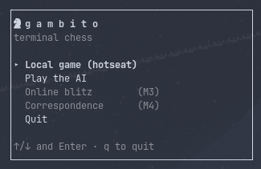
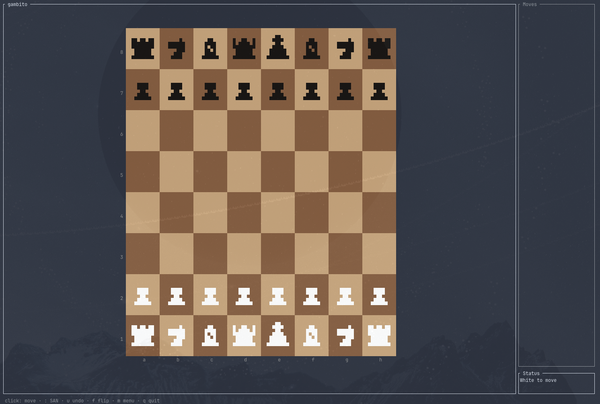

# ♟ Gambito

**A terminal chess game with a hand-rolled engine and a neural-network AI — no external chess or ML libraries at play time.**

Gambito is a Rust workspace that goes from bitboards all the way to an AlphaZero-style
player: move generation verified with perft, a PUCT Monte-Carlo tree search, and a
convolutional network trained in PyTorch but executed by **hand-written Rust inference**
embedded in a single ~2 MB binary.

<p align="center">
  
</p>

<p align="center">
  
</p>


## Features

- **Full chess engine** — bitboard position, legal move generation (castling,
  en passant, promotions), FEN, SAN, Zobrist hashing, UCI move parsing.
  Correctness pinned by perft tests against known node counts.
- **Terminal UI** — a [ratatui](https://ratatui.rs) interface: hotseat play for
  two humans, or *Play the AI*.
- **Neural-network AI** — PUCT MCTS (400 simulations, ~2 s/move) guided by a
  policy + value network. The net ships **inside the binary** as an int8,
  batch-norm-folded `.cyw` model (1.5 MB) and runs through hand-rolled,
  padding-unrolled convolutions at ~5 ms per forward pass. No ONNX, no torch,
  no GPU needed to play.
- **Training pipeline** — a PyTorch package (`python/gambito_train`) that
  encodes games, trains, exports to `.cyw`, and pits candidates against the
  reigning champion in a seeded-openings arena before a model earns its place
  in the binary.

## Quick start

```sh
cargo run --release -p gambito
```

That's it — pick *Play the AI* from the menu. Rust 1.75+ recommended.

## Workspace layout

| Crate / dir | What it is |
|---|---|
| `crates/gambito-engine` | Rules, bitboards, movegen, perft, FEN/SAN/UCI |
| `crates/gambito-ai` | MCTS, tensor encoding, `.cyw` inference (`nn.rs`), evaluator traits |
| `crates/gambito-tui` | ratatui screens and widgets |
| `crates/gambito` | The binary that ties it together |
| `python/gambito_train` | PyTorch training, export, self-play tooling |
| `docs/encoding.md` | The tensor & model format contract (see below) |

## How the AI works

The network sees the board as **19 planes of 8×8** (pieces from the
side-to-move's perspective, castling rights, en passant, halfmove clock) and
outputs a move-probability policy plus a position value. Search is
**PUCT MCTS**: the policy steers exploration, the value head replaces rollouts.

The exact tensor layout, policy indexing, and the `.cyw` int8 file format live
in [`docs/encoding.md`](docs/encoding.md) — a single contract that both the
Rust inference and the Python training implement, guarded by **cross-language
golden tests** (same position in, byte-compared tensors and priors out,
tolerance 2e-3).

The current embedded champion was trained on ~280k Lichess Elite games
(24.6 M positions, 47.1 % validation move accuracy) and won its arena match
against the previous model before being crowned. Self-play fine-tuning
infrastructure (Dirichlet noise, temperature sampling, replay-buffer mixing)
is in place for future generations.

## Training your own model

```sh
cd python
uv sync
uv run python -m gambito_train.train --data games.npz   # train
uv run python -m gambito_train.export ckpt.pt model.cyw # export int8
cargo run --release -p gambito-ai --example arena       # candidate vs champion
```

A CUDA GPU helps (an epoch over 24.6 M samples takes ~1 min on an RTX 5070)
but nothing in the play path requires one.

## Design notes

- The release profile optimizes for **size** (`opt-level = "z"`, fat LTO,
  ~2 MB binary) — except `gambito-ai`, which overrides to `opt-level = 3`
  because NN inference is the one hot loop that matters.
- Everything the AI needs is `include_bytes!`-embedded: clone, build, play.

## Roadmap

- [x] **M1** — engine + hotseat TUI
- [x] **M2** — neural-network AI, training & arena pipeline
- [ ] **M3** — online blitz (websockets)
- [ ] **M4** — correspondence chess (P2P + SQLite)

## License

MIT
